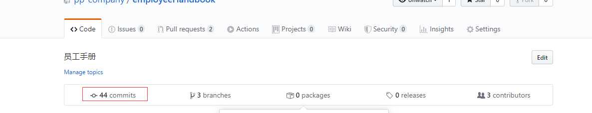
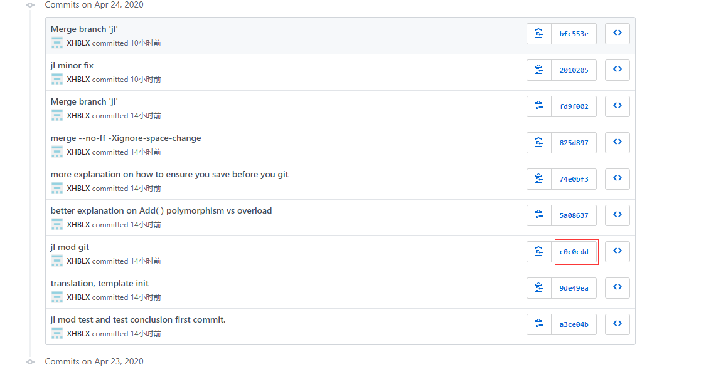
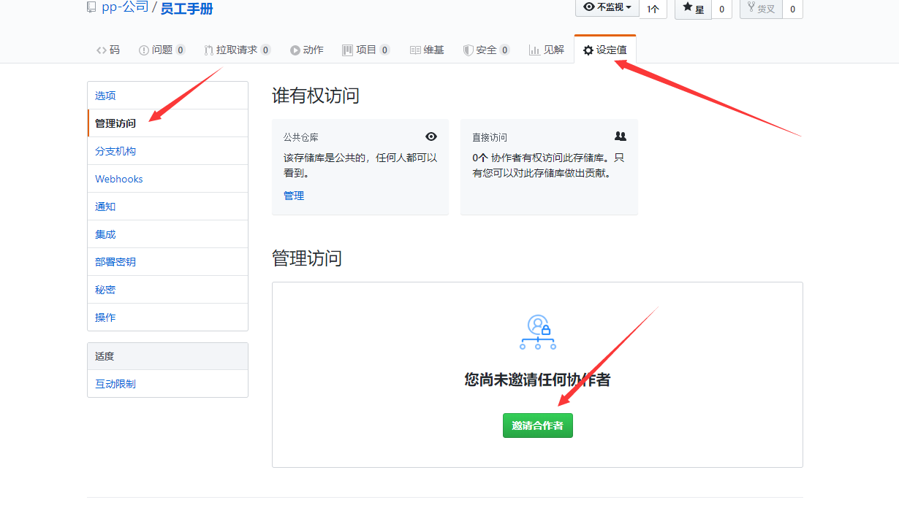
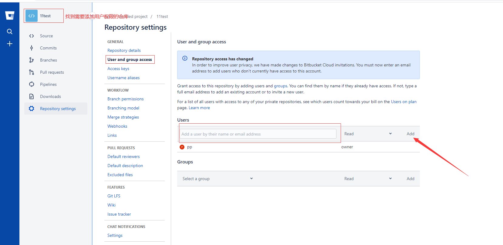

# 
git篇

0. ***在进行任何git操作的时候确保你IDE里的所有文件都保存了！不然git还在对你上次保存的版本进行操作！！！！！！！！！！！最保险的做法是，开启自动保存。 or 进行git操作前都统一编译一下代码。or 关闭IDE的所有页面也行（有点过于谨慎）。***
1. 每个人要申请额外的Bitbucket账号和github账号工作,因为离职的时候要把账号交还给公司的。
2. 对于没有保密需要的,在github上进行,比如员工手册。有保密需求,就用Bitbucket,比如平时的代码开发。如果不清楚有没有保密需求,直接问老板。
3. 学习git预计时间为20个小时，上下波动3小时，零基础大概23小时，有一点基础大概17小时，根据自己实际情况学习,学习期间需要掌握的[知识](git总结.md)。
4. 每个人要有一个github的练习账号,练习公司的[题目](git练习题.md)。
5. 写完git练习题之后，git练习题途中有什么不懂或者不了解的可以查看git练习题[提示](git练习题提示.md)。
6. 严禁使用可以修改历史的git操作。除非有老板明文授权。
7. 上传录音的时候注意文件大小不要超过100m(录音的时候建议超过80分钟就中断，再继续录音,如果不小心超过了，请查看如何减少[文件大小](https://jingyan.baidu.com/article/359911f550cf7757fe03063b.html)),仓库最大只能存放100G。
8. 之前被抛弃的commit突然发现有用可以用git reflog找回来。
9. [快捷方式](Shortcuts.sh)，中学毕业后才能使用
    1. git config --global -l git设置好后用这个检验是否成功
    2. windows,打开vsCode的终端，重新运行这行命令
    3. mac需要cd 路径; chmod +x ./Shortcut.sh; ./Shortcut.sh
10. git add -A 把所有的文件全部添加到暂存区。
11. git commit -m "备注" 一定要写清楚，练习可以随便写，工作要清楚。
12. 改名操作很容易把git弄晕,所以使用git做改名操作的时候最好单独放在一个commit来做改名，即 改名前commit一下，改名后马上又commit一下，甚至多个改名的时候都建议先改一部分commit再改一部分，非硬性要求 自己斟酌。
13. 了解一下[ssh private key](https://confluence.atlassian.com/bitbucket/set-up-an-ssh-key-728138079.html),使用谷歌浏览器可以翻译成中文。
14. 解决每次都要输入密钥[问题](http://www.wechatbus.com/artifice/9.html)
15. git push 忽略空目录
16. 每当你要进行实验或者各种骚操作或者危险操作，就要commit一下，不怕搞砸
18. 
    1. 使用git [diff](https://www.cnblogs.com/lsgxeva/p/8540485.html)对比两次提交的内容等....
    2. 在github上简易的diff
    
    
19. 
    1. github如何让别人管理自己的仓库
    
    
    2. Bitbucket如何让别人管理自己的仓库
    
20. [git多人合作要点](git多人合作要点.md)
21. [多人合作完整流程](多人合作完整流程.md)
22. 加减代码可以，尽量不要换代码的顺序
23. 学会使用[.gitignore](https://www.jianshu.com/p/699ed86028c2)
24. git返回的行太多了会自动隐藏
    1. j按行往下看
    2. k按行的往上看
    3. f按页往下看
    4. b按页往上看
    5. 空格可快速往下翻看
    6. q退出
    

 Copyright © 2021 天下数学引擎科技（深圳）有限公司 All Rights Reserved
