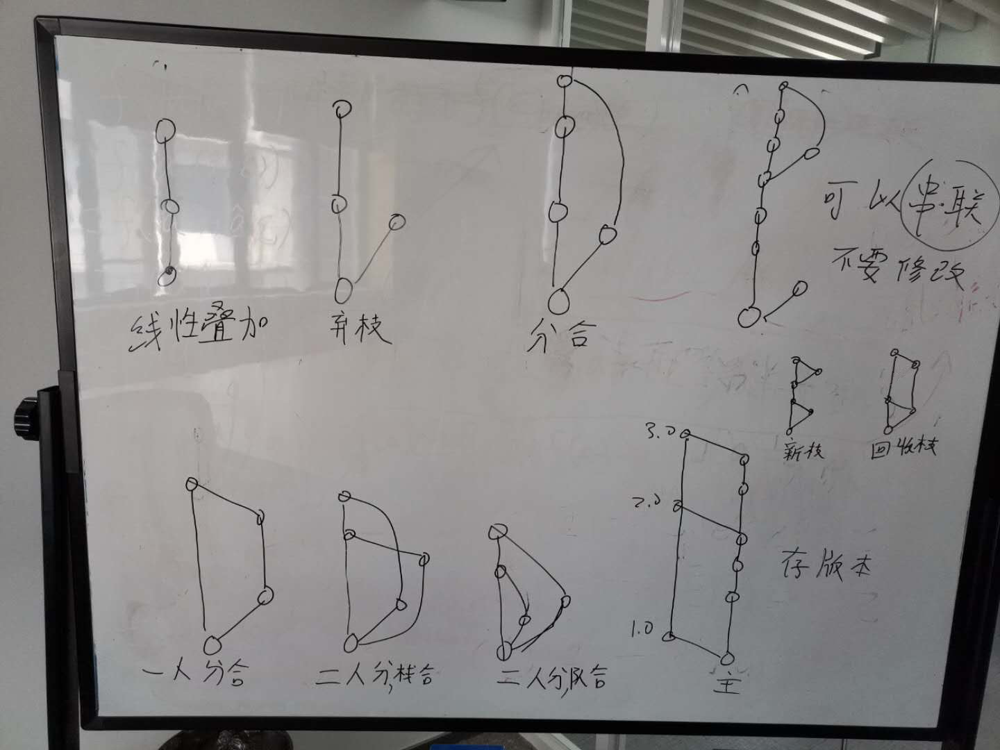

##
git练习题

1. 熟悉github和Bitbucket的使用，练习题往github和Bitbucket上传一遍，并注意对比两者的不同。
2. 写题的过程中可以练习一下回退命令。
    1. 如第2题的第2次提交了错误的内容，需要回到第1次提交重新编写，应该怎么做？
    2. 如第8题的第2次标签打错了，应该怎么返回？
    3. 如第10题的分支的第一次添加文件（还没提交），发现文件内容有问题需要修改，应该怎么做？
###小学考试题
1. 线性叠加。

2. 弃枝。

3. 分合。

4. 可以串联，不要修改。

5. 一人分合。

6. 二人分栈合   先进后出。

7. 二人分队合 先进先出。

8. 存版本。
 
 &ensp;主支&emsp;&emsp;&ensp;分支
9. 新枝。

10. 回收枝   分支（1）之后，合并主支，发现之前的分支（1）有bug，关联性很大，切换回之前的分支1，修复bug再合并到主支。

###中学考试题
1. （6、7）二人分栈合、二人分队合（txt）。
提升难度要求：手动解决冲突，git能解决大部分的冲突，这些情况得手动解决冲突，不知道1在前还是2在前，git没有那么智能。
主分支代码，，起床，睡觉。
分支1    起床、程序员1写代码，睡觉（合并）。
分支2    起床、程序员2写代码，睡觉（合并，会有冲突，需要手动解决冲突）。
手动改成  起床，1写代码，2写代码（顺序无所谓，但是都得写代码），睡觉。
2. 使用word和pdf再做一遍第1题的二人分栈合、二人分队合，对比一下使用word、pdf、txt各有什么不同
###小学、中学考试题图解

