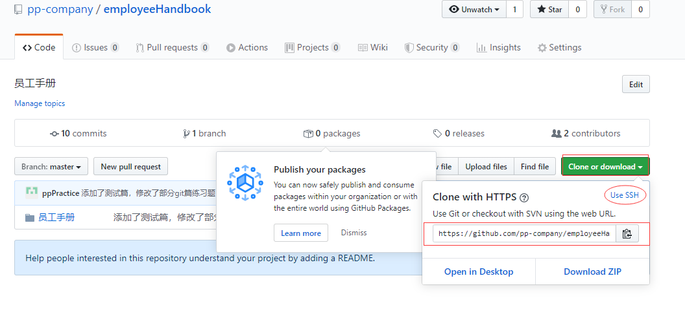
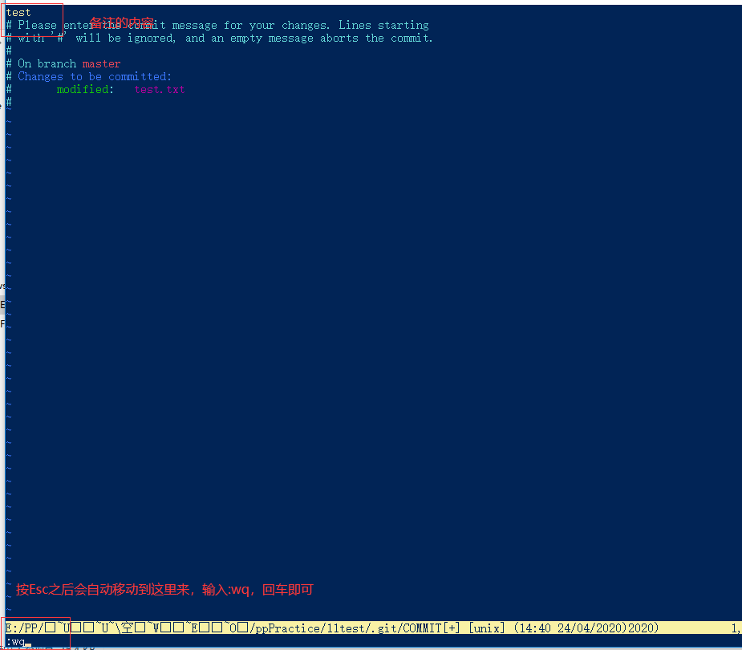

##
git练习题

###小学考试题
1. 线性叠加，三次add、commit文件(难点在于:学会commit现在的工作并且push到服务器上)
    1. git add 文件名(test.txt) 将工作目录下的文件(test.txt)添加到暂存区，git add -A 是将所有修改、新增、删除的文件都添加到暂存区
    2. git commit -m “备注” 将暂存区的文件commit到git本地仓库，并且可以备注（练习可以随意，工作的时候要写清楚）
    3. 可以认为一次commit就代表一个节点
    4. git remote add origin 添加远程仓库地址
    
    5. git push origin master 将本地仓库master主分支推送到远程仓库master主分支（master是特殊的，不需要切换到master,只要是推送到远程仓库的master分支都会将本地仓库的master分支推送）
    6. 第一次推送的时候可以使用git push -u origin master，下次推送的时候git push(push到第一次-u设定的分支,当前在哪个分支，就是push到第一次-u设定的分支上)就行了
2. 弃枝(难点:把一个跟master脱节的分支push上去)。
    1. git switch -c 分支名(dev)  创建并且切换分支名(dev)
    2. 切换到分支(dev)之后需要修改文件内容，add、commit文件，留住节点  
    3. 此时指针指向了分支1(dev)，表示当前正在分支1(dev)，题目需要回去master主支操作，需要切换到主支进行下一步操作
    4. git switch 分支名(master) 切换到分支名(master)，进行下一次修改文件内容，add、commit,git switch 可以进行分支之间的切换
    5. git push origin 分支名(dev) 将当前所在的分支推送到远程仓库分支(dev)，这里需要注意，你当前在哪个分支下，本地分支名跟远程分支名要一致，将本地仓库主支master push 远程仓库master上，再去远程仓库看一下，发现只能看到master，看不到dev，因为dev分支没有merge到master上，所以需要额外再切换到dev分支上，再git push  origin 分支名(dev)，记得第一次推送应该做什么?
    6. 注意：
        1. git switch 不存在的分支名(报错，无效引用)
        2. git switch 已经存在的分支名(会切换到分支名)
        3. git switch -c 不存在的分支名(创建并且切换分支名)
        4. git switch -c 已经存在的分支名(报错，提醒分支已经存在,并且当前还在切换并创建前的分支上)
3. 分合(难点在于:分了之后学会合并回来，体验git的自动合并优势)54 02 81
    1. 在主支(master)的第三次commit之后，使用git merge –no-ff -m “备注” 分支名（dev）合并，将分支名(dev)合并到master，组成一个新的节点
    2. git merge –no-ff -m “备注” 分支名（dev） 普通模式合并，合并后的历史有分支
4. 可以串联，不要修改(难点:组合之前学过的技巧)
5. 一人分合。
6. 二人分栈合 先进后出(难点:体验在没有冲突的情况下，谁先合并谁后合并对结果不产生影响)
    1. 两个分支都分别commit了一次（一个节点）
    2. 区别在于：第一个分支先分出来，第二个分支后分出来，第二个分支先合并，第一个分支后合并，先分后合
7. 二人分队合 先进先出
    1. 两个分支都分别commit了一次（一个节点）
    2. 区别在于：第一个分支先分出来，第二个分支后分出来，第一个分支先合并，第二个分支后合并，先分先合
8. 存版本(难点:强制commit，学会跟一条长期存在的分支打交道)
    1. 只有一个分支，并且该分支的第一次commit是强制commit的再添加标签，第二个标签跟第三个标签是将主分支合并到分支再添加标签
    2. git commit --allow-empty -m "备注"  强制commit，即使没有新的改动，也会强制commit
    3. git tag 标签   给当前分支的当前节点添加一个标签
9. 新枝(难点:删除旧枝，创建新枝)。
    删除分支：git branch -d 分支名
10. 回收枝(难点:在相关性很大的情况下，也不用每次都创建一个分支):分支（dev）之后，合并到主支之后，发现之前的分支(dev)有bug，关联性很大，回到分支(dev)，修复bug
12. git reset –hard id     返回指定的版本
13. git tag -d <tagname>   删除指定的标签
14. git commit之后会弹出一个编辑窗口，按I键插入内容，将你要备注的内容输入进去，按Esc键,:wq（保存），回车

###中学考试题
1. （6、7）二人分栈合、二人分队合（txt）。
     1. 使用git status查看哪个文件有冲突，然后打开那个文件，里面有箭头，其中<<<<<<< HEAD是指主---------分支修改的内容>>>>>>> dev2 是指dev2上修改的内容
     2. 解决完冲突之后保存文件，重新add、commit
2. 使用word和pdf再做一遍第1题的二人分栈合、二人分队合，对比一下使用word、pdf、txt各有什么不同。
word和pdf难点在于，得人工去找冲突在哪里，git帮不了任何忙，一行两行还好说，要是几百行，人工肉眼一行一行去检查哪里冲突了。
总结：先合并的人不需要手动解决冲突，后合并的人需要手动解决冲突，所以谁后合并谁倒霉
###大学考试题
2. 在merge里加个-Xignore-space-change参数，git又可以重新自动解决冲突了

 Copyright © 2020 珠海数镜空时科技有限公司 All Rights Reserved
