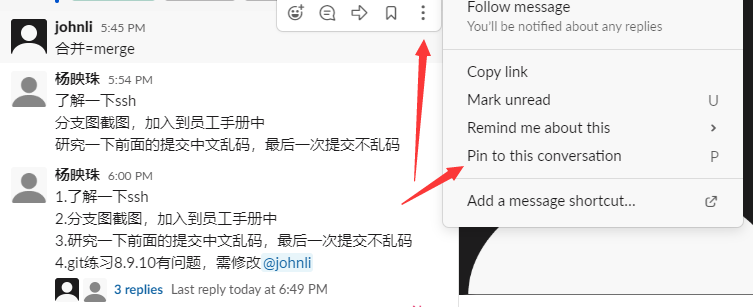
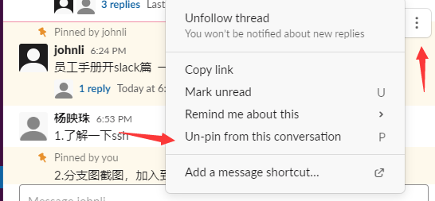
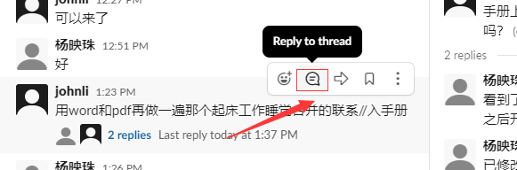
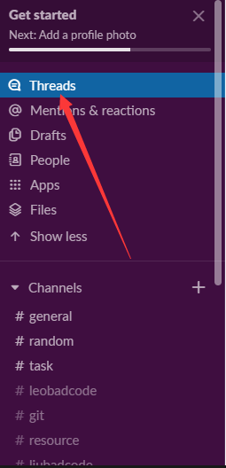
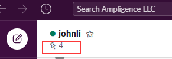

##
slack篇

1. 钉（pin）消息，取消钉（unpin）消息。

2. 回复消息。

3. 关于任务:
    1. 你的所有任务老板都会帮你钉起来，做完之后自己把它取钉。
    2  . 如果老板布置了一个任务忘了帮你钉起来，自己把它钉起来。
    3. 收到任务后不用每个都回复“收到、好……” 老板会默认你收到了。 做完后也不要回复 “完成、做完了……” 把它取钉就代表你做完了。。
5. 如果你回复的消息是跟之前的消息密切相关的，你不要像微信一样直接回复，你应该直接开一个分支然后回复，请参考第2点。
6. 如果有什么需要长期记忆的东西，你可以把它星标起来。
7. 可以查看回复的消息

8. 可以查看被钉起来的所有内容

9 slack安卓版会提示没有谷歌服务的问题，忽略它，继续使用，正常消息还是能接收的，注意延迟
10. 老板发在#general里面钉起来的任务，任何人都可以揭榜去挑战。 
