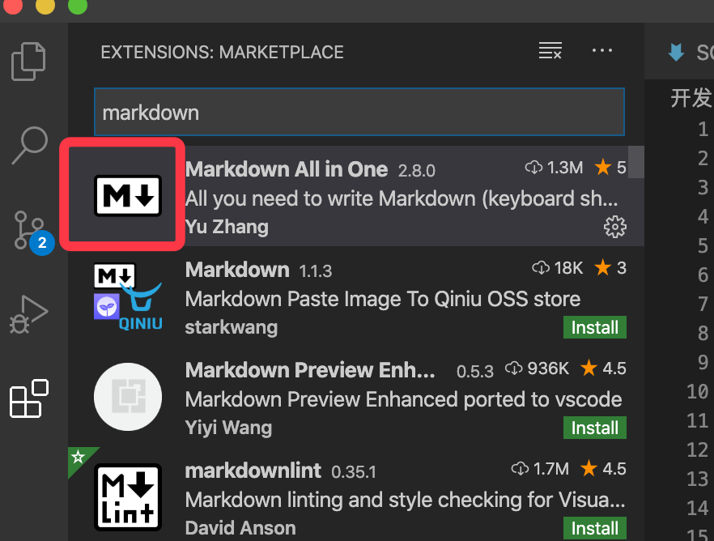
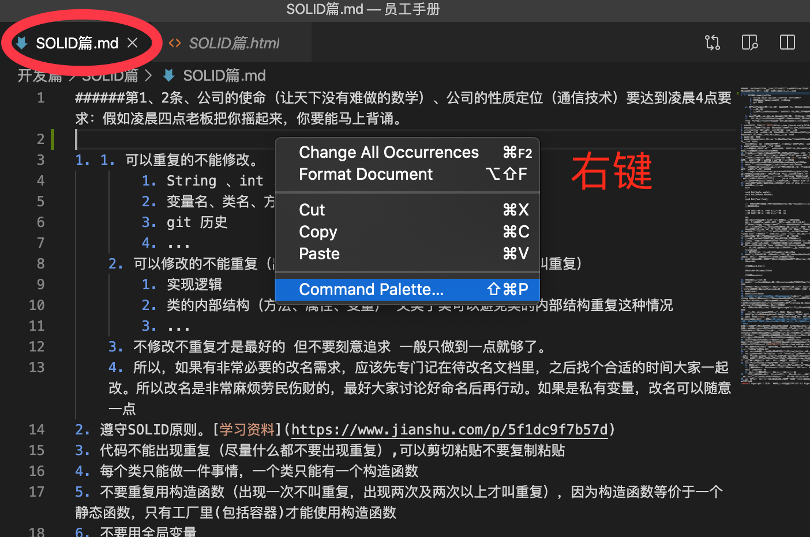
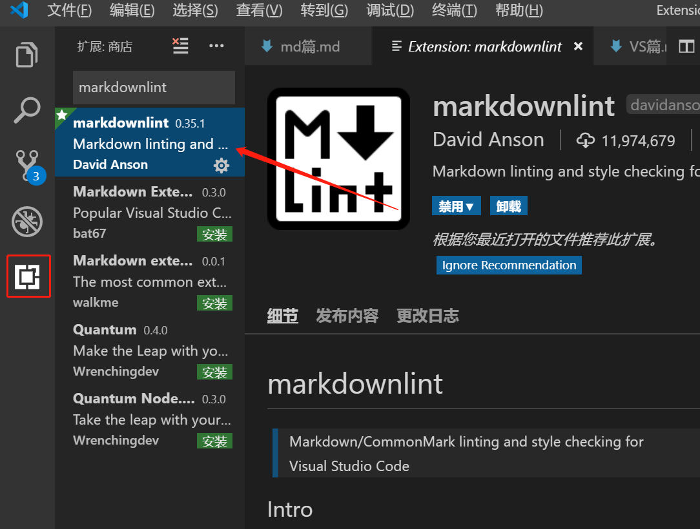
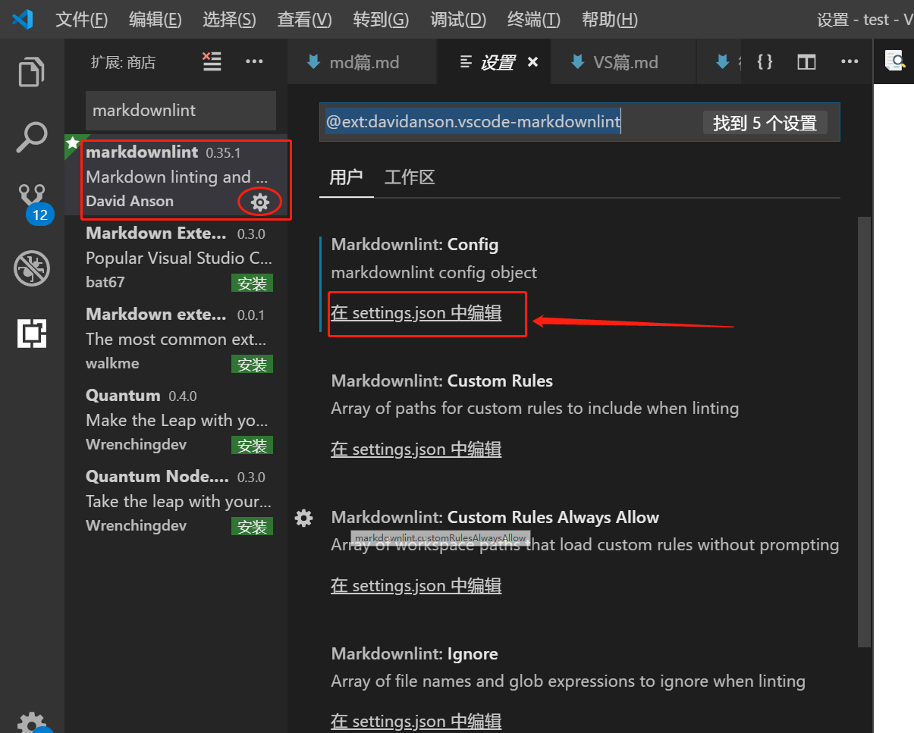
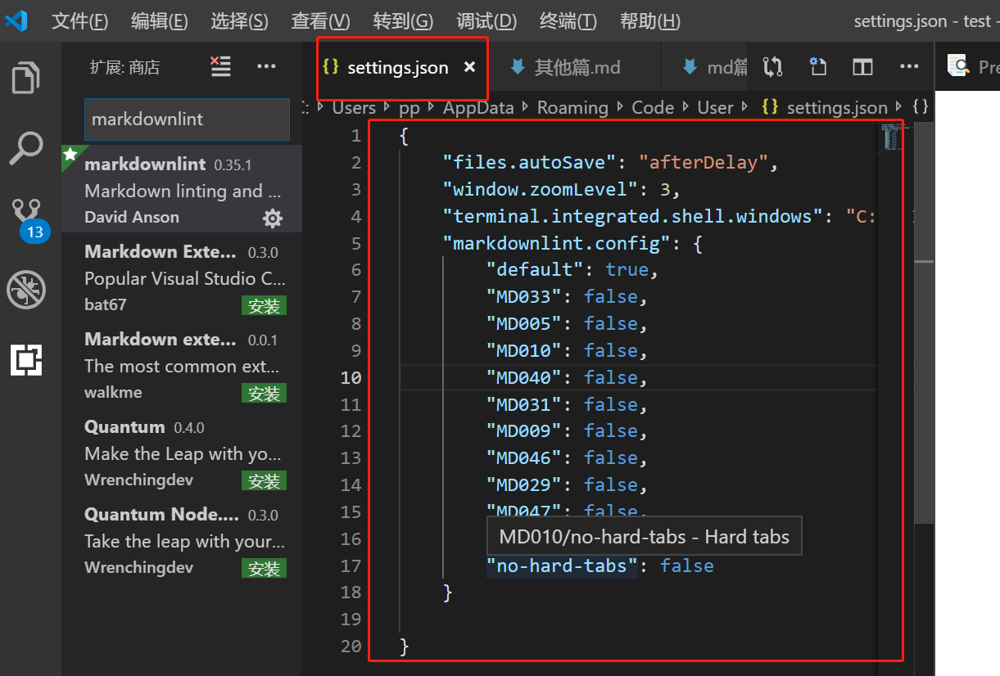

# <center>md篇</center>

1. md导出.pdf
    1. 在vsCode里下载一个Markdown Preview Enhanced的插件找到要打印的md文件，用插件预览，
    在预览那里右键-->open in Browser-->右键-->打印-->找到需要的打印机-->去掉页眉页脚-->打印
    2. 另一种方法，推荐第一种 
     
     
     
     
2. 语法检查配置
    1. 安装markdownlint插件
    
    2. 在插件的设置里面找到你的配置文件
    
    3. 配置忽略检查
    
    ```
    "markdownlint.config": {
        "default": true,
        "MD033": false,
        "MD005": false,
        "MD010": false,
        "MD040": false,
        "MD031": false,
        "MD009": false,
        "MD046": false,
        "MD029": false,
        "MD047": false,
        "MD036": false,
        "no-hard-tabs": false
    }
    ```     
    
<center> Copyright © 2021 天下数学引擎科技（深圳）有限公司 All Rights Reserved</center>