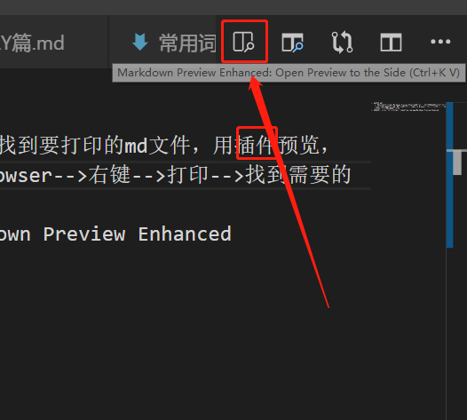
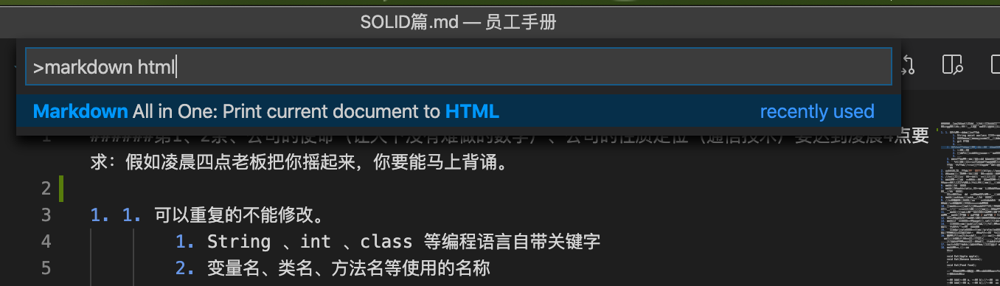
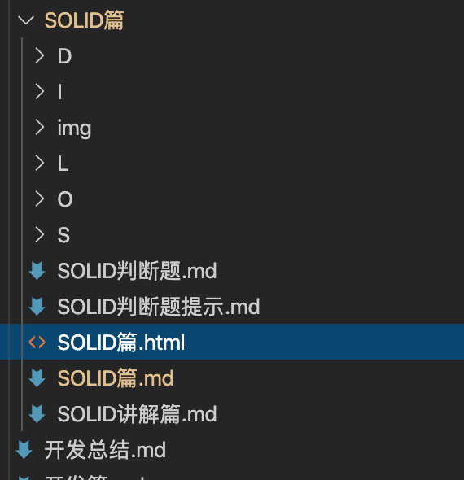

1. md导出.pdf
    1. 在vsCode里下载一个Markdown Preview Enhanced的插件找到要打印的md文件，用插件预览，
    在预览那里右键-->open in Browser-->右键-->打印-->找到需要的打印机-->去掉页眉页脚-->打印
    2. 另一种方法，推荐第一种 
     
     
     
     
2. 辅助构思 [简易流程图](https://code2flow.com/app)Markdown Preview Enhanced
