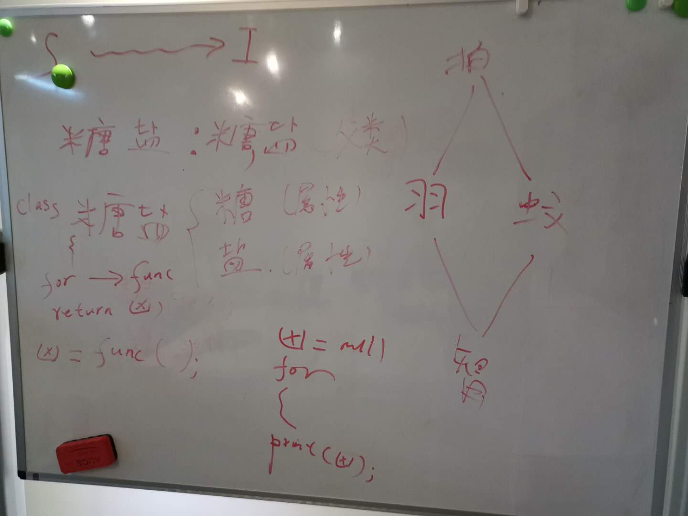

###
里氏替换原则

1. 解释:子类必须可以替换父类，还不出问题
2. O篇里的羽毛球拍跟电蚊拍之间没有谁是父类谁是子类，因为不能让羽毛球拍去打蚊子，也不能让电蚊拍去打羽毛球
3. 如何鉴定一个继承是不是合法的，就看子类能不能替换父类
4. 例：如果现在出了一个新型智能拍子，来一个羽毛球，新型智能拍子就能打球，来一个蚊子新型智能拍子就能打蚊子，那么这个新型智能拍子就是一个合法的子类
5. 问题：永远不要使用null   
    1. 类型，父可以指向子，子不可以指向父（强转例外）
    2. 任何东西能够指向null，相当于null是所有的东西子类，可以替换所有的东西，L原则说子类必须可以替换父类，null做得到吗？子类null替换任何东西都会出问题
    3. 语法上什么都能替换，实际上什么都不能替换
    4. 代码格式，如果允许null的存在，那么拿到一个变量都得检查一下是不是null
6. 图解:
