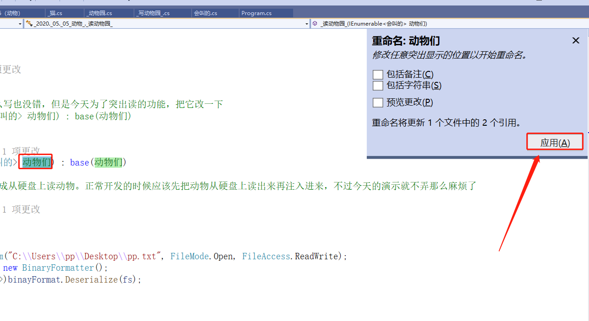
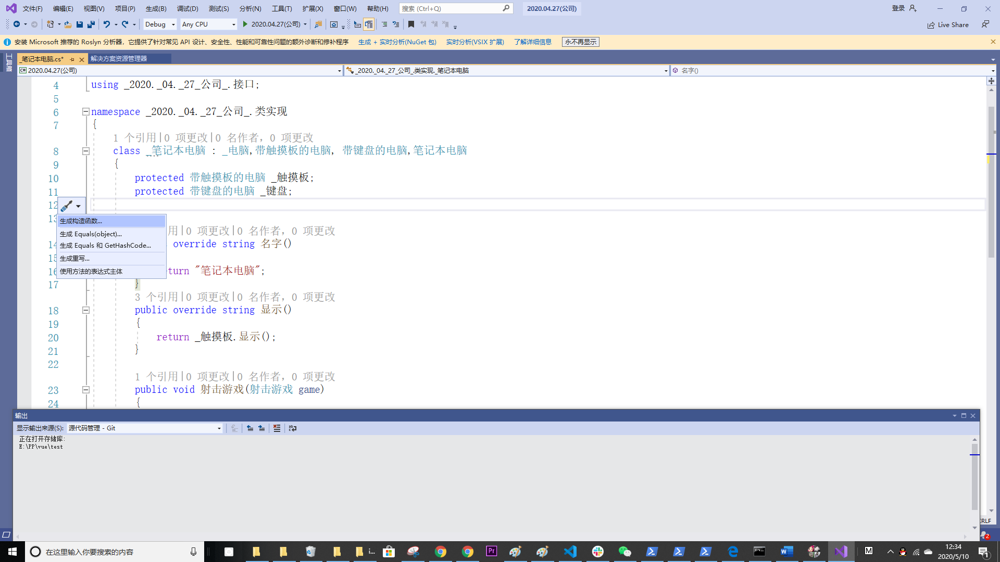

###
VS篇

1. 重命名，一个变量名或者类名需要修改，可是其他的地方又有用到，要改的话就要全部改，通过vs自带的工具做到这件事，不要手动自己改，选中要修改的名字-->右键-->重命名-->修改成想要的名字-->应用

2. 构造函数的生成，选择一个空白的地方-->右键-->快速操作和重构-->生成构造函数

3. 通过接口实现方法

3. 提取代码块为独立函数，选择需要提取的代码块-->右键-->快速操作和重构-->提取方法
4. 联想
    1. 写下之前定义过的名字，只需要写下一个就会有提示
    2. 使用vs自带的一些方法或类，写下几个字母就会有提示
    3. new 类之后按Alt+Enter键可,选择第三个自动补全类型跟变量名,填好按回车即可
5. [查看类图](https://blog.csdn.net/zhangpeterx/article/details/97920984),安装完之后如果用不了重启软件或者重启电脑试试
6. Ctrl+K+C(注释)、Ctrl+K+U(取消注释) 