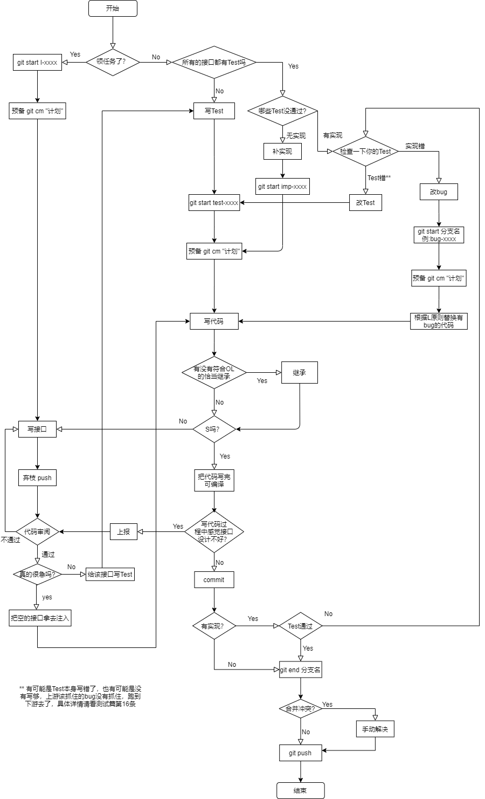

# <center>开发篇</center>

1. 公司代码的发布途径是git。
2. 写代码,不可以复制粘贴,后期有时间,会开发一个插件,监听键盘,如果复制粘贴,会发出警告,某某某复制粘贴了。
3. 避免代码冗余。
4. 接口名和文件名要一致，类名和文件名也要一致
5. 类名前面+_,比如电脑类,_电脑。
6. 变量要加_,参数不加_，方便初始化
7. 大括号要对齐，因为研究表明这种格式可以被最多的人接受

    ```
    class _带触摸板的电脑 : _电脑, 带触摸板的电脑
    {
        public override string 名字()
        {
            return "_带触摸板的电脑名字";
        }
        public void 点击(点 d)
        {
            Console.WriteLine(d);
        }
    }
    ```
7. 在windows正确的改名方式是选中要改名的字，然后按Ctrl+F2。mac是cmd+r
8. (非强制)对于方法，没有参数没有返回值是最好的，有一个参数比有多个参数好，三个参数以上设计有问题，对于私有方法通常都是没有参数没有返回值的
9. [循环依赖](循环依赖.md)
10. 变量能写到外面就写到外面，具体情况自己分析
11. 完整工作流程

12. 多人合作开发时，我们让测试、实现、接口分工开发
    1. 推荐:
        1. A:写东西，锋利的，锋利的测试
        2. B:削笔刀 （等A写完测试之后再实现）
    2. 不推荐:
        1. A:写东西，锋利的，削笔刀
        2. B:锋利的测试
    3. 错误的:
        1. A:写东西，锋利的
        2. B:削笔刀,锋利的测试
    4. [表格](文件/表格.xlsx)
13. 所有新建立的接口都必须要老板审阅批准，如果老板实在太忙，至少要经过两位其他同事审阅
14. 如何系统地升级内部方法代码
    1. 问题:该功能只在类内部使用，功能是对的，但是不符合S原则，要想办法清理一下
    2. 答案:
        1. 权限降级，改成protected，为了跟接口断开关系，确保重命名没有改变接口的方法
        2. 将方法重命名说明一下负作用
        3. 重写接口的方法，并且没有负作用
        4. 改变代码逻辑
    3. 总结:之前用了，那就用了，之后用的，要用好的
15. 如何系统地升级别人已经在用的内部方法
    1. 问题:你发现这个方法符合S原则，可是已经被别人调用了，你不能乱改，改了之后别人会出bug
    2. 答案:
        1. 将方法重命名说明一下负作用
        2. 在接口里重新写一个好的方法
        3. 在实现里面实现这个方法并且调用好的方法
        4. 改变代码逻辑
        5. 去接口把坏的方法删掉，会报错
        6. 把之前坏的方法代码复制，粘贴到报错的地方，每个报错的地方都需要手动展开一下
        7. 将需要开放出去的方法开放出去
16. 如何系统地升级接口实现
    1. 打开要升级的实现class对应接口
    2. 将需要升级的方法（批量）重命名（包括接口上的一起批量重命名）成更准确的意思//既然你要升级它，现有的哪儿不好，明文写出来表现在方法名上
    3. 打开接口，再直接把刚才的重命名改回来（不要使用批量重命名）。git diff -w 现接口 与原接口应该是一样的
    4. 这样会导致接口、实现、调用的不匹配。
    5. 打开实现class，生成缺失的新接口实现
    6. 升级就两种情况，增加功能（需符合S+L），or 减少副作用，把新旧两个方法整理成 新=旧+X or 旧=新+X 的形式
    7. commit
    3. 按照 新=旧+X or 旧=新+X 的逻辑，把所有调用处(包括内部和外部)的报错修复。注意替换时要符合L原则
    9. run test
16. 接口，实现，测试，容器之间的依赖关系:实现依赖接口，测试依赖接口，容器依赖实现，接口 (and Test???)
17. 哪怕是一行代码，也要根据具体情况抽离出去
    1. 例:
    ```
    Console.WriteLine(Math.Pow(2, 100));
    ```
    2. 问题:
        1. Math.Pow()是第三方工具，使用第三方工具我们也要做好封装隔离
        2. Console.WriteLine()，为了更好的扩展，比如以后可能需要每次调用的时候增加功能，加粗，斜体等等，如果抽离出去，只需要在方法里面补充相应的代码，需要的时候调用即可
    
<center> Copyright © 2021 天下数学引擎科技（深圳）有限公司 All Rights Reserved</center>